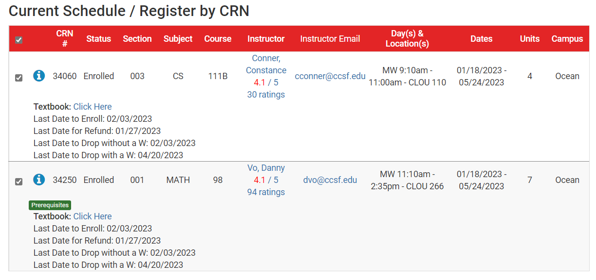
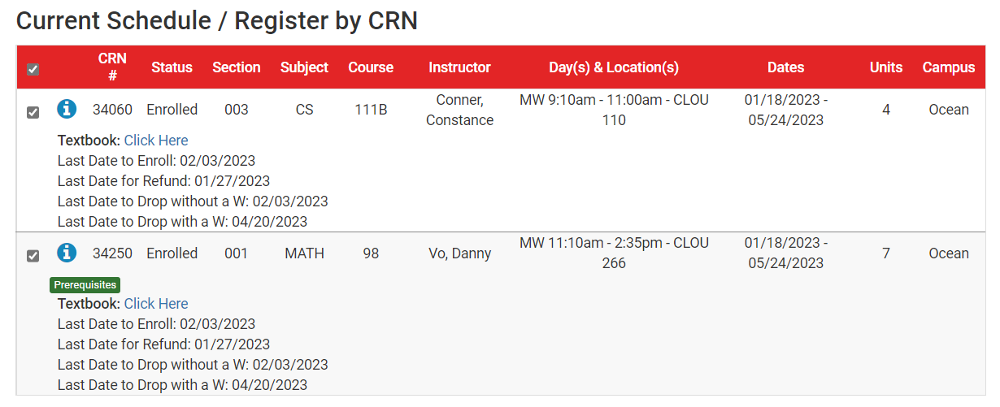

  

<h1 align="center">CCSF Schedule Planner Helper</h1>

  
  
  
  
  

  <h3>
    <a href="https://ccsfsph.github.io/">
      Document
    </a>
     | 
    <a href="https://github.com/ccsfsph/ccsf-schedule-planner-helper/issues">
      Report Issues
    </a>
  </h3>

  <strong>CCSFSPH (City College of San Francisco Schedule Planner Helper), a free, convenient, powerful and open source user script, run on Tampermonkey.</strong> 

Document: [https://ccsfsph.github.io/](https://ccsfsph.github.io/)

Open source: [https://github.com/ccsfsph/ccsf-schedule-planner-helper](https://github.com/ccsfsph/ccsf-schedule-planner-helper)

Report issues: [https://github.com/ccsfsph/ccsf-schedule-planner-helper/issues](https://github.com/ccsfsph/ccsf-schedule-planner-helper/issues)

Any questions, feedbacks, contact us by: [ccsfsph@gmail.com](mailto:ccsfsph@gmail.com)

After use:

Before use:

